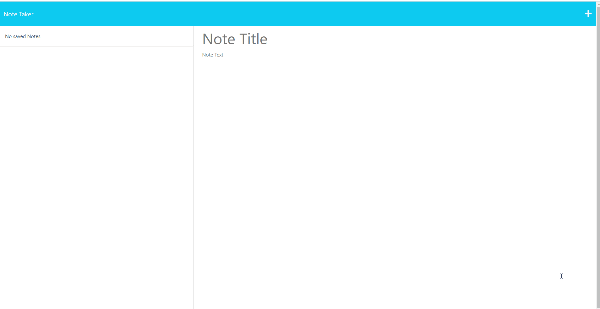

  # Note Taker Express
  
  ## Table of Contents
  * [Description](#Description)
  * [Installation](#Installation)
  * [Usage](#Usage)
  * [Contribute](#Contribute)
  * [License](#License)
  * [Questions](#Questions)
  * [Future Development](#Future-Development)
  * [Credits](#Credits)

  ## Description
Using Node.js and Express.js this note taker app will store notes locally in a json file. The user can add, delete, and view notes. The app is deployed on Heroku.

  ## Demo
  Here is a live link to the deployed application on Heroku: [Note Taker Express](https://note-taker-codemodeactivate.herokuapp.com/)
  ## Usage
  Use it however you'd like! Preferably to take notes.
  ## Contribute
  Fork it, baby!
  ## License
  http://www.wtfpl.net/

  

  ## Questions
  If you have any questions, please contact me at jeff.zenko@gmail.com. You can also find me on GitHub at [codemodeactivate](https://github.com/codemodeactivate).
  ## Future Development
  Maybe one day I'll continue to build off of this and store to the files in a real database of some sort.
  ## Credits
  uuid package helped a TON, as well as the previous course work I could look at for examples.
